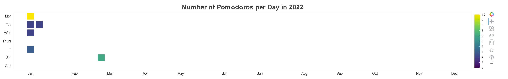

# Pomodoro_Viewer

This code is meant to facilitate visualization of pomodoros.  It assumes a data
format of a folder containing text files with time stamps corresponding to each
pomodoro! (It doesn't matter if this timestamp corresponds to the start or end
of the pomodoro - but it might be useful to be consistent!).

To see an example of the format expected please checkout the folder
'test_folder'.  There is no need to write the time stamps from different days
into different files, though the code will search all files in the provided
folder matching that format.

There are several types of graphs which are generated. I will describe them
below as they are implemented:

1 - Calendar View Plot.

This is an html plot of a calendar (one per year of data that you have!).  Each
day contains a heatmap tile showing how many pomodoros you completed that day.
You can either count this number using the color bar provided or you can hover
over the square and it will tell you. This is an example of what such a plot
might look like:

In order to call this function from the command line here is the required
argument:
` python folder_to_graph.py PATH_TO_POMODORO_DATA_FOLDER`

Where PATH_TO_POMODORO_DATA_FOLDER is a variable you should replace with your
 local path to the pomodoro data folder. 
